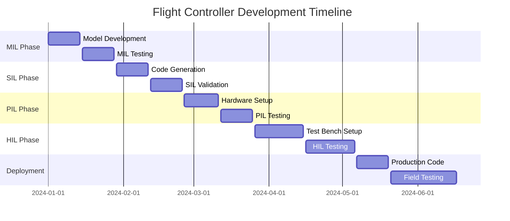

# CodeDroneDIY Flight Controller - Deployment Roadmap

## From MATLAB Code → Simulink Model → MIL/SIL → HIL → Hardware Deployment

This document provides a comprehensive step-by-step roadmap for deploying the CodeDroneDIY flight controller from MATLAB prototype to production hardware.

---

## Phase 1: Model-in-the-Loop (MIL) Testing

### 1.1 Initial Setup and Validation

**Objective:** Validate Simulink model against original MATLAB code

**Duration:** 1-2 weeks

**Prerequisites:**
- MATLAB/Simulink R2021b or later
- Aerospace Blockset (optional, for enhanced visualization)
- Stateflow (for state machine implementation)

**Steps:**

1. **Environment Setup**
   ```matlab
   % Navigate to project directory
   cd('path/to/CodeDroneDIY')
   
   % Load bus definitions
   run('bus_definitions.m')
   
   % Build the Simulink model
   run('build_model.m')
   ```

2. **Model Validation**
   ```matlab
   % Run comprehensive test suite
   run('test_harness.m')
   
   % Compare with original MATLAB results
   load('CodeDroneDIY_Results.mat')  % Original results
   sim('CodeDroneDIY_FlightController')  % Simulink results
   
   % Validation script
   compare_mil_results(data, yout)
   ```

3. **Functional Testing**
   - Verify all block I/O mappings
   - Test state machine transitions
   - Validate PID controller responses
   - Check motor mixing logic
   - Verify safety mechanisms

**Deliverables:**
- ✅ Functional Simulink model
- ✅ Validation test results
- ✅ Performance comparison report

---

## Phase 2: Software-in-the-Loop (SIL) Testing

### 2.1 Code Generation and Compilation

**Objective:** Generate and test embedded C code

**Duration:** 2-3 weeks

**Prerequisites:**
- Embedded Coder
- Simulink Coder
- C compiler (GCC, MSVC, or target-specific)

**Steps:**

1. **Code Generation Setup**
   ```matlab
   % Apply solver configuration
   solver_config('CodeDroneDIY_FlightController')
   
   % Configure for code generation
   set_param('CodeDroneDIY_FlightController', 'SystemTargetFile', 'ert.tlc')
   set_param('CodeDroneDIY_FlightController', 'TargetLang', 'C')
   ```

2. **Build SIL Block**
   ```matlab
   % Generate SIL block
   rtwbuild('CodeDroneDIY_FlightController')
   
   % Create SIL test model
   create_sil_test_model()
   ```

3. **SIL Validation**
   ```matlab
   % Run SIL vs MIL comparison
   run_sil_validation_tests()
   
   % Performance profiling
   profile_sil_execution()
   ```

**Key Validation Points:**
- Numerical accuracy (floating-point vs fixed-point)
- Execution timing analysis
- Memory usage profiling
- Integer overflow detection
- Code coverage analysis

**Deliverables:**
- ✅ Generated C code
- ✅ SIL validation results
- ✅ Code metrics report
- ✅ Memory and timing analysis

---

## Phase 3: Processor-in-the-Loop (PIL) Testing

### 3.1 Target Hardware Preparation

**Objective:** Test on actual target processor

**Duration:** 2-4 weeks

**Prerequisites:**
- Target hardware (ARM Cortex-M4, Pixhawk, etc.)
- Cross-compilation toolchain
- Hardware debugging tools (JTAG, SWD)

**Supported Target Platforms:**

| Platform | Processor | RAM | Flash | FPU | Notes |
|----------|-----------|-----|-------|-----|-------|
| Pixhawk 4 | STM32F765 | 512KB | 2MB | Yes | Recommended |
| Arduino Due | SAM3X8E | 96KB | 512KB | No | Limited capability |
| Raspberry Pi 4 | Cortex-A72 | 4GB | SD Card | Yes | Linux-based |
| STM32F4 Discovery | STM32F407 | 192KB | 1MB | Yes | Development board |

**Steps:**

1. **Hardware Configuration**
   ```matlab
   % Configure for specific target
   configure_for_deployment('pixhawk')  % or 'arduino', 'raspberry_pi'
   
   % Set target-specific parameters
   set_target_hardware_config()
   ```

2. **Cross-Compilation Setup**
   ```bash
   # Example for ARM Cortex-M4
   export ARM_TOOLCHAIN=/path/to/gcc-arm-none-eabi
   export TARGET_DEVICE=STM32F407VG
   ```

3. **PIL Block Generation**
   ```matlab
   % Generate PIL block
   set_param('CodeDroneDIY_FlightController', 'CreateSILPILBlock', 'PIL')
   rtwbuild('CodeDroneDIY_FlightController')
   ```

4. **Hardware Communication Setup**
   - Configure serial/USB communication
   - Set up real-time data exchange
   - Implement watchdog and safety mechanisms

**Deliverables:**
- ✅ Target-specific compiled code
- ✅ PIL test results
- ✅ Real-time performance metrics
- ✅ Hardware validation report

---

## Phase 4: Hardware-in-the-Loop (HIL) Testing

### 4.1 HIL Test Bench Setup

**Objective:** Test complete system with real sensors and actuators

**Duration:** 3-6 weeks

**Required Hardware:**
- Flight controller board
- IMU sensor (MPU6050/ICM20689)
- Radio receiver (SBUS/PPM)
- ESCs and motors
- Test bench/gimbal system
- Data acquisition system

**HIL Architecture:**
```
[Simulink Host] ←→ [Real-Time Interface] ←→ [Flight Controller Hardware]
       ↑                                              ↓
[Plant Model]                                    [Real Sensors/Actuators]
```

**Steps:**

1. **Hardware Integration**
   ```matlab
   % Configure for HIL testing
   apply_hardware_in_loop_template(cs)
   
   % Set up real-time interface
   setup_realtime_interface()
   ```

2. **Sensor Integration**
   - IMU calibration and noise characterization
   - Radio receiver signal validation
   - Actuator response testing
   - Sensor fusion validation

3. **Plant Model Development**
   ```matlab
   % Create quadcopter dynamics model
   create_quadcopter_plant_model()
   
   % Integrate with HIL system
   connect_hil_plant_model()
   ```

4. **Flight Test Scenarios**
   - Hover stability tests
   - Attitude step responses
   - Disturbance rejection tests
   - Emergency scenarios
   - Flight envelope testing

**Safety Considerations:**
- Hardware safety interlocks
- Emergency stop mechanisms
- Tethered testing protocols
- Progressive flight testing

**Deliverables:**
- ✅ HIL test bench
- ✅ Sensor characterization data
- ✅ Flight test results
- ✅ System identification data

---

## Phase 5: Hardware Deployment

### 5.1 Production Hardware Setup

**Objective:** Deploy to final production hardware

**Duration:** 4-8 weeks

**Steps:**

1. **Production Code Generation**
   ```matlab
   % Final code generation with optimizations
   set_param('CodeDroneDIY_FlightController', 'OptimizationLevel', 'Level2')
   set_param('CodeDroneDIY_FlightController', 'OptimizationPriority', 'Speed')
   
   % Generate production code
   rtwbuild('CodeDroneDIY_FlightController')
   ```

2. **Bootloader and Firmware Integration**
   ```c
   // Integration with existing bootloader
   #include "CodeDroneDIY_FlightController.h"
   
   int main(void) {
       // Hardware initialization
       HAL_Init();
       
       // Model initialization
       CodeDroneDIY_FlightController_initialize();
       
       // Main loop
       while(1) {
           CodeDroneDIY_FlightController_step();
           wait_for_next_cycle();
       }
   }
   ```

3. **Field Testing and Validation**
   - Ground testing protocols
   - Progressive flight testing
   - Performance validation
   - Reliability testing

**Deliverables:**
- ✅ Production firmware
- ✅ Field test results
- ✅ Certification documentation
- ✅ User manual and documentation

---

## Continuous Integration Pipeline

### CI/CD Workflow

```yaml
# .github/workflows/flight-controller-ci.yml
name: Flight Controller CI/CD

on: [push, pull_request]

jobs:
  mil-testing:
    runs-on: ubuntu-latest
    steps:
      - uses: actions/checkout@v2
      - name: Setup MATLAB
        uses: matlab-actions/setup-matlab@v1
      - name: Run MIL tests
        uses: matlab-actions/run-command@v1
        with:
          command: test_harness(); exit(0);
  
  sil-testing:
    needs: mil-testing
    runs-on: ubuntu-latest
    steps:
      - name: Generate SIL code
        run: rtwbuild('CodeDroneDIY_FlightController')
      - name: Run SIL validation
        run: run_sil_validation_tests()
  
  hardware-deployment:
    needs: sil-testing
    if: github.ref == 'refs/heads/main'
    runs-on: ubuntu-latest
    steps:
      - name: Deploy to test hardware
        run: deploy_to_hardware.sh
```

---

## Quality Assurance and Validation

### Verification Matrix

| Requirement | MIL | SIL | PIL | HIL | Hardware |
|-------------|-----|-----|-----|-----|----------|
| Functional correctness | ✅ | ✅ | ✅ | ✅ | ✅ |
| Real-time performance | ⚠️ | ✅ | ✅ | ✅ | ✅ |
| Hardware compatibility | ❌ | ❌ | ✅ | ✅ | ✅ |
| Sensor integration | ❌ | ❌ | ❌ | ✅ | ✅ |
| Flight performance | ❌ | ❌ | ❌ | ✅ | ✅ |
| Environmental testing | ❌ | ❌ | ❌ | ⚠️ | ✅ |

### Test Coverage Requirements

- **Unit Tests:** >95% line coverage
- **Integration Tests:** >90% branch coverage
- **System Tests:** 100% requirement coverage
- **Hardware Tests:** 100% interface coverage

---

## Risk Management

### Technical Risks and Mitigation

| Risk | Probability | Impact | Mitigation |
|------|-------------|---------|------------|
| Real-time performance | Medium | High | Early PIL testing, performance profiling |
| Hardware compatibility | Low | High | Thorough hardware validation |
| Sensor noise/drift | Medium | Medium | Robust filtering, calibration procedures |
| Safety system failure | Low | Critical | Redundant safety mechanisms |
| Code generation errors | Low | Medium | Extensive SIL/PIL validation |

### Safety Considerations

1. **Fail-Safe Mechanisms**
   - Watchdog timers
   - Motor cut-off switches
   - Emergency landing protocols
   - Communication loss handling

2. **Testing Protocols**
   - Progressive test phases
   - Tethered testing
   - Remote emergency stop
   - Automated safety monitoring

---

## Tools and Environment

### Required Software Tools

| Tool | Purpose | License | Version |
|------|---------|---------|---------|
| MATLAB/Simulink | Model development | Commercial | R2021b+ |
| Embedded Coder | Code generation | Commercial | Latest |
| Stateflow | State machine design | Commercial | Latest |
| Git | Version control | Free | Latest |
| ARM GCC | Cross-compilation | Free | 10.0+ |

### Hardware Test Equipment

| Equipment | Purpose | Estimated Cost |
|-----------|---------|----------------|
| Oscilloscope | Signal analysis | $2,000-5,000 |
| Logic analyzer | Digital debugging | $500-2,000 |
| Test bench | HIL testing | $5,000-15,000 |
| Flight test area | Hardware validation | Variable |

---

## Timeline and Milestones

### Development Schedule



### Key Milestones

- **M1:** MIL validation complete (Week 4)
- **M2:** SIL code generation successful (Week 6)
- **M3:** PIL hardware integration (Week 8)
- **M4:** HIL test bench operational (Week 12)
- **M5:** Production firmware ready (Week 20)
- **M6:** Field testing complete (Week 24)

---

## Success Criteria

### Performance Metrics

| Metric | Target | Measurement Method |
|--------|--------|--------------------|
| Control loop frequency | 400 Hz ±1% | Real-time profiling |
| Attitude error (hover) | <2° RMS | Flight test data |
| Motor response time | <5 ms | Hardware measurement |
| Code efficiency | >80% CPU utilization | Profiling tools |
| Memory usage | <64 KB RAM | Static analysis |

### Deliverable Quality Gates

1. **Code Quality**
   - Zero critical bugs
   - MISRA C compliance (advisory)
   - Documented APIs

2. **Test Quality**
   - All tests passing
   - Coverage requirements met
   - Performance benchmarks achieved

3. **Documentation**
   - User manual complete
   - Technical documentation current
   - Change log maintained

---

## Support and Maintenance

### Post-Deployment Support

1. **Issue Tracking**
   - Bug reporting system
   - Performance monitoring
   - User feedback collection

2. **Update Procedures**
   - Over-the-air updates
   - Version control
   - Rollback mechanisms

3. **Continuous Improvement**
   - Performance optimization
   - Feature enhancements
   - Hardware compatibility updates

---

## Conclusion

This roadmap provides a comprehensive path from MATLAB prototype to production hardware deployment. Each phase builds upon the previous one, with increasing levels of hardware integration and testing complexity. Following this structured approach ensures a robust, reliable flight controller system ready for real-world deployment.

The key to success is thorough testing at each phase, proper risk management, and maintaining focus on safety throughout the development process. Regular reviews and milestone assessments help ensure the project stays on track and meets its objectives.
